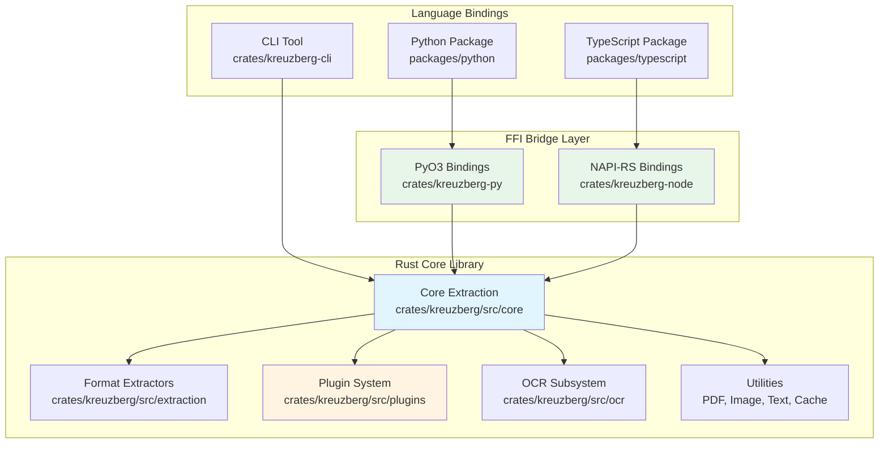
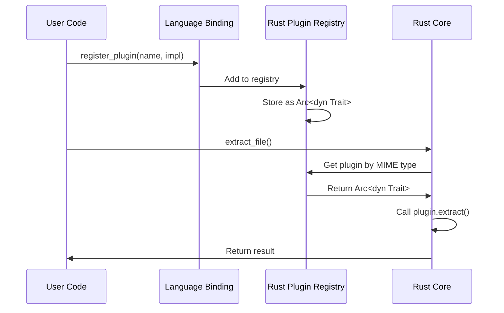
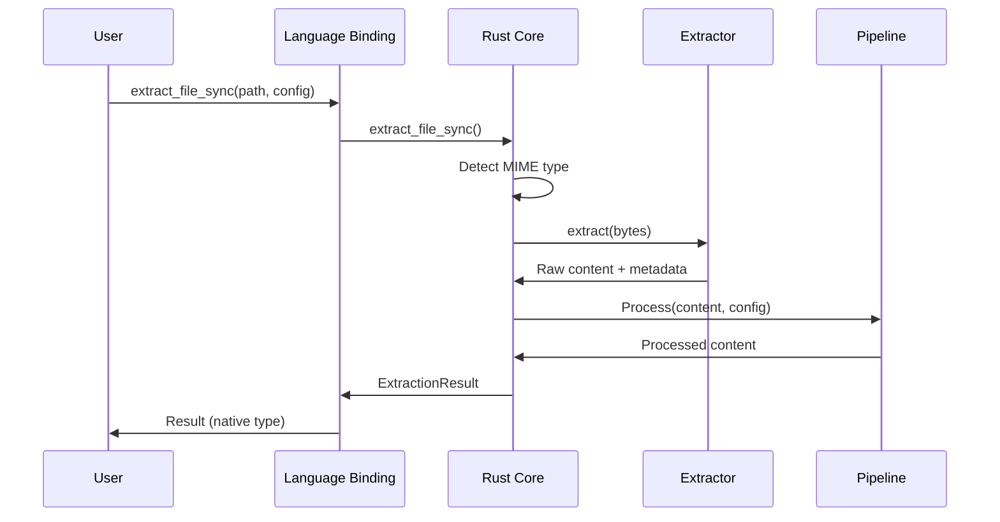
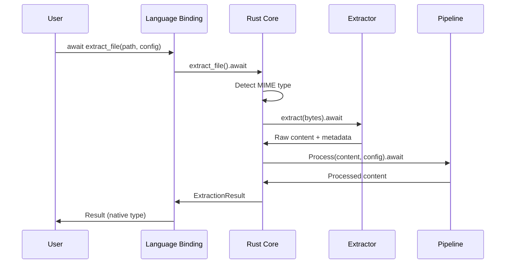

# Architecture

Kreuzberg v4 is built on a high-performance Rust core with language bindings for Python and TypeScript. This architecture provides native-level performance while offering idiomatic APIs for multiple languages.

## System Architecture



## Rust Core Library

The Rust core (`crates/kreuzberg`) is a standalone library that can be used directly in Rust projects or through language bindings.

### Core Responsibilities

- **MIME Type Detection**: Automatic format detection for 118+ file extensions
- **Extraction Orchestration**: Coordinates extraction across multiple formats
- **Plugin Management**: Registry-based plugin system for extensibility
- **Pipeline Processing**: Post-processing and validation pipeline
- **Configuration**: TOML/YAML/JSON configuration file discovery

### Key Modules

#### `src/core/`
The orchestration layer that coordinates all extraction operations:

- **`extractor.rs`**: Main API surface - `extract_file()`, `extract_bytes()`, `batch_extract_*()`
- **`registry.rs`**: Maps MIME types to extractors, manages plugin registration with priority support
- **`mime.rs`**: MIME detection and validation
- **`pipeline.rs`**: Post-processing pipeline orchestration
- **`config.rs`**: Configuration loading and validation
- **`io.rs`**: File I/O utilities with async support

#### `src/extraction/`
Format-specific extraction implementations:

- **`pdf.rs`**: PDF extraction using pdfium-render (text + images)
- **`excel.rs`**: Excel/spreadsheet extraction using calamine
- **`email.rs`**: Email parsing using mail-parser
- **`html.rs`**: HTML to markdown conversion
- **`xml.rs`**: Memory-efficient XML streaming parser
- **`text.rs`**: Plain text and markdown streaming parser
- **`image.rs`**: Image extraction and preprocessing
- **`structured.rs`**: JSON/YAML/TOML parsing
- **`pandoc.rs`**: Pandoc integration for document conversion
- **`pptx.rs`**: PowerPoint extraction
- **`archive.rs`**: ZIP/archive extraction

#### `src/plugins/`
Trait-based plugin system for extensibility:

- **`traits.rs`**: Base `Plugin` trait
- **`extractor.rs`**: `DocumentExtractor` trait for format extractors
- **`ocr.rs`**: `OcrBackend` trait for OCR engines
- **`processor.rs`**: `PostProcessor` trait for pipeline processors
- **`validator.rs`**: `Validator` trait for validation hooks
- **`registry.rs`**: Four plugin registries (extractor, OCR, processor, validator)

#### `src/ocr/`
OCR subsystem for text extraction from images:

- **`processor.rs`**: OCR orchestration and coordination
- **`tesseract_backend.rs`**: Native Tesseract backend implementation
- **`cache.rs`**: OCR result caching for performance
- **`hocr.rs`**: hOCR format parsing
- **`table/`**: Table detection and reconstruction from OCR results

## FFI Bridge Layer

The bridge layer provides seamless integration between Rust and higher-level languages.

### PyO3 Bindings (`crates/kreuzberg-py`)

Exposes the Rust core to Python using PyO3:

- **Type Conversion**: Automatic conversion between Rust and Python types
- **Async Bridge**: Maps Rust async functions to Python coroutines
- **Error Handling**: Converts Rust `Result<T, E>` to Python exceptions
- **Plugin Registration**: Allows Python classes to be registered as Rust plugins
- **Zero-Copy**: Efficient data passing using PyO3's memory management

**Example PyO3 Function**:
```rust
#[pyfunction]
pub fn extract_file_sync(
    path: PathBuf,
    mime_type: Option<String>,
    config: PyExtractionConfig,
) -> PyResult<PyExtractionResult> {
    // Call Rust core
    let result = kreuzberg::extract_file_sync(&path, mime_type.as_deref(), &config.inner)
        .map_err(|e| PyErr::new::<PyRuntimeError, _>(format!("{}", e)))?;

    // Convert to Python type
    Ok(PyExtractionResult::from(result))
}
```

### NAPI-RS Bindings (`crates/kreuzberg-node`)

Exposes the Rust core to TypeScript/Node.js using NAPI-RS:

- **Type Safety**: Generates TypeScript type definitions automatically
- **Promise Bridge**: Maps Rust async functions to JavaScript Promises
- **Buffer Handling**: Efficient binary data handling with Node.js Buffers
- **Error Mapping**: Converts Rust errors to JavaScript Error objects
- **Cross-Platform**: Prebuilt binaries for Linux, macOS, Windows (x64, ARM64)

**Example NAPI Function**:
```rust
#[napi]
pub fn extract_file_sync(
    path: String,
    mime_type: Option<String>,
    config: ExtractionConfig,
) -> Result<ExtractionResult> {
    // Call Rust core
    let result = kreuzberg::extract_file_sync(
        Path::new(&path),
        mime_type.as_deref(),
        &config.inner
    )
    .map_err(|e| Error::from_reason(format!("{}", e)))?;

    // Convert to JavaScript type
    Ok(ExtractionResult::from(result))
}
```

## Language-Specific Extensions

Each language binding adds idiomatic features on top of the Rust core.

### Python Package (`packages/python`)

Thin Python layer that adds:

- **Python OCR Backends**: EasyOCR and PaddleOCR implementations that register with Rust core
- **API Server**: Litestar-based HTTP API (`kreuzberg._api`)
- **CLI Tools**: Click-based command-line interface
- **Type Stubs**: Complete `.pyi` files for IDE support
- **Async/Sync Variants**: Both `asyncio` and synchronous APIs

**Architecture**:
```
packages/python/kreuzberg/
├── __init__.py              # Main API exports
├── _internal_bindings.pyi   # Type stubs for Rust bindings
├── exceptions.py            # Python exception hierarchy
├── ocr/
│   ├── protocol.py          # OCR backend protocol
│   ├── easyocr.py          # EasyOCR implementation
│   └── paddleocr.py        # PaddleOCR implementation
├── _api/                    # Litestar API server
└── _cli/                    # Click CLI
```

### TypeScript Package (`packages/typescript`)

TypeScript layer that adds:

- **Type Definitions**: Auto-generated from NAPI-RS bindings
- **Promise-Based API**: Idiomatic async/await support
- **Error Classes**: TypeScript error class hierarchy
- **TypeScript PostProcessors**: Custom post-processor implementations

**Architecture**:
```
packages/typescript/
├── src/
│   ├── index.ts             # Main API exports
│   └── types.ts             # TypeScript type definitions
├── index.d.ts               # Auto-generated type definitions
└── index.node               # Native binary (platform-specific)
```

### CLI Tool (`crates/kreuzberg-cli`)

Standalone Rust binary providing:

- **Command-Line Interface**: Direct access to Rust core
- **Configuration Files**: TOML/YAML/JSON config support
- **Batch Processing**: Glob pattern support for multiple files
- **JSON Output**: Structured output for scripting

## Plugin System Architecture

The plugin system allows extensibility across all languages.

### Plugin Types

1. **DocumentExtractor**: Extract text from specific file formats
2. **OcrBackend**: Provide OCR services (Python-only)
3. **PostProcessor**: Transform extraction results
4. **Validator**: Validate extraction results

### Cross-Language Plugins

| Plugin Type | Rust | Python | TypeScript |
|-------------|------|--------|------------|
| DocumentExtractor | ✅ | ❌ | ❌ |
| OcrBackend | ✅ | ✅ | ❌ |
| PostProcessor | ✅ | ✅ | ✅ |
| Validator | ✅ | ✅ | ✅ |

### Plugin Registration Flow



## Performance Characteristics

### Why Rust Core?

- **Memory Safety**: No garbage collection pauses, deterministic memory management
- **Zero-Cost Abstractions**: High-level code compiles to optimal machine code
- **Concurrent Processing**: Safe concurrent extraction with Tokio async runtime
- **SIMD Optimizations**: Fast text processing with SIMD instructions
- **Minimal Overhead**: FFI calls are optimized with zero-copy where possible

### Benchmarks

Compared to pure Python/JavaScript implementations:

- **10-50x faster** text processing (token reduction, quality scoring)
- **3-5x faster** PDF extraction (native pdfium vs Python wrappers)
- **2-3x faster** batch processing (Tokio concurrent execution)

## Data Flow

### Synchronous Extraction



### Asynchronous Extraction



## Thread Safety

All Rust components are designed for safe concurrent access:

- **Plugin Registries**: Use `RwLock<HashMap>` for thread-safe registration
- **Cache Layer**: Lock-free caching with atomic operations
- **Extractors**: Stateless design, safe to call from multiple threads
- **OCR Backends**: Thread-safe with internal synchronization

Python and TypeScript bindings preserve thread safety through proper GIL/event loop handling.

## Next Steps

- [Extractors](extractors.md) - How format extraction works
- [OCR System](ocr.md) - OCR subsystem architecture
- [Plugin System](plugins.md) - Plugin development guide
