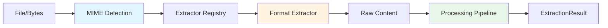

# Extractors

Extractors are the core components responsible for converting various document formats into structured text, metadata, and tables. Kreuzberg includes built-in extractors for 20+ file formats, and you can add custom extractors through the plugin system.

## How Extraction Works

### Extraction Pipeline



### Step-by-Step Process

1. **MIME Type Detection**
   - Analyze file extension (fast path)
   - Analyze file content (magic bytes) if extension is ambiguous
   - Support for 118+ file extensions
   - Configurable with `mime_type` parameter to skip detection

2. **Extractor Selection**
   - Query extractor registry with MIME type
   - Select highest priority extractor for the format
   - Fall back to text extraction if no specific extractor found

3. **Content Extraction**
   - Extractor processes file bytes
   - Returns structured content, metadata, and tables
   - Memory-efficient streaming for large files where possible

4. **Post-Processing Pipeline**
   - OCR processing (if enabled)
   - Quality scoring
   - Token reduction (if enabled)
   - Language detection (if enabled)
   - Chunking (if enabled)
   - Custom post-processors

## MIME Type Detection

Kreuzberg uses a two-stage MIME detection system:

### Extension-Based Detection

Fast lookup by file extension:

```rust
// Internal mapping
".pdf" -> "application/pdf"
".docx" -> "application/vnd.openxmlformats-officedocument.wordprocessingml.document"
".jpg" -> "image/jpeg"
".png" -> "image/png"
```

### Content-Based Detection

Analyzes file magic bytes when extension is missing or ambiguous:

| Format | Magic Bytes |
|--------|-------------|
| PDF | `%PDF-` |
| ZIP/DOCX/XLSX | `PK\x03\x04` |
| PNG | `\x89PNG\r\n\x1a\n` |
| JPEG | `\xFF\xD8\xFF` |
| GIF | `GIF87a` or `GIF89a` |

### Supported Formats

| Category | MIME Types | Extractors |
|----------|-----------|------------|
| **PDF** | `application/pdf` | PdfExtractor |
| **Word** | `application/vnd.openxmlformats-officedocument.wordprocessingml.document` | PandocExtractor |
| **Legacy Word** | `application/msword` | LegacyWordExtractor (LibreOffice) |
| **Excel** | `application/vnd.openxmlformats-officedocument.spreadsheetml.sheet`<br>`application/vnd.ms-excel` | ExcelExtractor |
| **PowerPoint** | `application/vnd.openxmlformats-officedocument.presentationml.presentation` | PowerPointExtractor |
| **Legacy PowerPoint** | `application/vnd.ms-powerpoint` | LegacyPresentationExtractor (LibreOffice) |
| **Email** | `message/rfc822`<br>`application/vnd.ms-outlook` | EmailExtractor |
| **HTML** | `text/html` | HtmlExtractor |
| **XML** | `application/xml`<br>`text/xml`<br>`image/svg+xml` | XmlExtractor |
| **Text** | `text/plain`<br>`text/markdown` | PlainTextExtractor |
| **Images** | `image/jpeg`<br>`image/png`<br>`image/tiff`<br>`image/bmp`<br>`image/webp` | ImageExtractor (requires OCR) |
| **Structured** | `application/json`<br>`application/yaml`<br>`application/toml` | StructuredExtractor |
| **Archives** | `application/zip`<br>`application/x-tar`<br>`application/gzip` | ArchiveExtractor |

## Built-in Extractors

### PDF Extractor

**Implementation**: Rust using `pdfium-render`

**Features**:
- Text layer extraction (native PDF text)
- Image extraction from PDF pages
- Embedded image detection
- Page-level metadata
- Table detection (when OCR enabled)

**Metadata Extracted**:
- `pageCount` - Number of pages in the PDF
- `title` - Document title
- `author` - Document author
- `subject` - Document subject
- `keywords` - Document keywords
- `creator` - Creating application
- `producer` - PDF producer/converter
- `creationDate` - Document creation date
- `modificationDate` - Last modification date

**Example**:
=== "Python"

    ```python
    from kreuzberg import extract_file_sync, ExtractionConfig

    result = extract_file_sync("document.pdf", config=ExtractionConfig())
    print(f"Pages: {result.metadata['page_count']}")
    print(f"Text: {result.content}")
    ```

=== "TypeScript"

    ```typescript
    import { extractFileSync, ExtractionConfig } from '@goldziher/kreuzberg';

    const result = extractFileSync('document.pdf', null, new ExtractionConfig());
    console.log(`Pages: ${result.metadata.page_count}`);
    console.log(`Text: ${result.content}`);
    ```

### Excel Extractor

**Implementation**: Rust using `calamine`

**Features**:
- Multi-sheet extraction
- Cell value preservation
- Formula display values
- Merged cell handling
- Sheet-level metadata

**Metadata Extracted**:
- `sheetCount` - Number of sheets in the workbook
- `sheetNames` - Array of sheet names

**Table Extraction**: Each sheet becomes a table in `result.tables[]`

**Example**:
=== "Python"

    ```python
    from kreuzberg import extract_file_sync, ExtractionConfig

    result = extract_file_sync("spreadsheet.xlsx", config=ExtractionConfig())
    print(f"Sheets: {', '.join(result.metadata['sheet_names'])}")

    for table in result.tables:
        print(f"Table: {table.markdown}")
    ```

=== "TypeScript"

    ```typescript
    import { extractFileSync, ExtractionConfig } from '@goldziher/kreuzberg';

    const result = extractFileSync('spreadsheet.xlsx', null, new ExtractionConfig());
    console.log(`Sheets: ${result.metadata.sheet_names.join(', ')}`);

    for (const table of result.tables) {
        console.log(`Table: ${table.markdown}`);
    }
    ```

### Email Extractor

**Implementation**: Rust using `mail-parser`

**Features**:
- Header parsing (From, To, Subject, Date)
- Plain text and HTML body extraction
- Attachment extraction (if extractable formats)
- Thread-ID and In-Reply-To tracking
- Nested message handling

**Metadata Extracted**:
- `fromEmail` - Sender email address
- `fromName` - Sender display name
- `toEmails` - Array of recipient email addresses
- `ccEmails` - Array of CC email addresses
- `bccEmails` - Array of BCC email addresses
- `messageId` - Unique message identifier
- `attachments` - Array of attachment filenames

**Note**: Subject and date are extracted into the main `content` field

**Example**:
=== "Python"

    ```python
    from kreuzberg import extract_file_sync, ExtractionConfig

    result = extract_file_sync("email.eml", config=ExtractionConfig())
    print(f"From: {result.metadata['from']}")
    print(f"Subject: {result.metadata['subject']}")
    print(f"Body: {result.content}")
    ```

=== "TypeScript"

    ```typescript
    import { extractFileSync, ExtractionConfig } from '@goldziher/kreuzberg';

    const result = extractFileSync('email.eml', null, new ExtractionConfig());
    console.log(`From: ${result.metadata.from}`);
    console.log(`Subject: ${result.metadata.subject}`);
    console.log(`Body: ${result.content}`);
    ```

### HTML Extractor

**Implementation**: Rust using `html-to-markdown-rs`

**Features**:
- HTML to markdown conversion
- YAML frontmatter extraction
- Link preservation
- Image alt text extraction
- Code block preservation
- Table extraction
- Inline image extraction

**Metadata Extracted** (21 fields):

**Basic SEO**:
- `title` - Page title from `<title>` tag
- `description` - Meta description
- `keywords` - Meta keywords
- `author` - Meta author
- `canonical` - Canonical URL
- `baseHref` - Base URL for relative links

**Open Graph**:
- `ogTitle` - Open Graph title
- `ogDescription` - Open Graph description
- `ogImage` - Open Graph image URL
- `ogUrl` - Open Graph URL
- `ogType` - Open Graph content type
- `ogSiteName` - Open Graph site name

**Twitter Card**:
- `twitterCard` - Twitter card type
- `twitterTitle` - Twitter card title
- `twitterDescription` - Twitter card description
- `twitterImage` - Twitter card image URL
- `twitterSite` - Twitter site handle
- `twitterCreator` - Twitter creator handle

**Link Relationships**:
- `linkAuthor` - Author link URL
- `linkLicense` - License link URL
- `linkAlternate` - Alternate version URL

### XML Extractor

**Implementation**: Rust using `quick-xml` (streaming parser)

**Features**:
- Memory-efficient streaming for large XML files
- Element counting and unique element tracking
- Text content extraction (filters XML structure)
- Preserves whitespace optionally

**Metadata Extracted**:
- Element count
- Unique elements

**Performance**: Can process multi-GB XML files with minimal memory usage.

### Plain Text & Markdown Extractor

**Implementation**: Rust streaming parser

**Features**:
- Line-by-line streaming for large files
- Markdown metadata extraction (headers, links, code blocks)
- Word count, line count, character count
- CRLF line ending support

**Metadata Extracted (Markdown only)**:
- Headers (list of all headers found)
- Links (list of all URLs)
- Code blocks (count)
- Line count, word count, character count

### PowerPoint Extractor

**Implementation**: Rust using `pptx-rs`

**Features**:
- Slide text extraction
- Speaker notes extraction
- Slide titles and content separation
- Image extraction

**Metadata Extracted**:
- `title` - Presentation title
- `author` - Presentation author
- `description` - Presentation description
- `summary` - Presentation summary
- `fonts` - Array of fonts used in the presentation

### Image Extractor

**Implementation**: Rust using `image-rs` + OCR backends

**Features**:
- Image preprocessing (resize, denoise, contrast adjustment)
- DPI calculation and adjustment for optimal OCR
- OCR text extraction (requires OCR backend)
- Multi-format support (JPEG, PNG, TIFF, BMP, WebP)

**Metadata Extracted**:
- `width` - Image width in pixels
- `height` - Image height in pixels
- `format` - Image format (jpeg, png, tiff, etc.)
- `exif` - EXIF metadata as key-value pairs (includes DPI, color space, camera info, etc.)

**Requires**: OCR configuration with `config.ocr = OcrConfig(...)`

### Structured Data Extractor

**Implementation**: Rust using `serde_json`, `serde_yaml`, `toml`

**Features**:
- JSON, YAML, TOML parsing
- Pretty-printed text representation
- Preserves structure in text output

**Metadata Extracted**:
- Format type
- Key count (top-level keys)

### Archive Extractor

**Implementation**: Rust using `zip` crate

**Features**:
- Recursive extraction of nested archives
- Per-file extraction within archive
- Supports ZIP, TAR, GZIP
- Aggregates content from all extractable files

**Metadata Extracted**:
- `format` - Archive format (zip, tar, gzip)
- `fileCount` - Number of files in archive
- `fileList` - Array of file paths within archive
- `totalSize` - Total uncompressed size in bytes
- `compressedSize` - Compressed archive size in bytes (if available)

### Pandoc Extractor

**Implementation**: Rust subprocess integration with Pandoc

**Features**:
- Supports formats Pandoc can read (DOCX, ODT, EPUB, etc.)
- Markdown output for consistent processing
- System dependency (must have Pandoc installed)

**Supported Formats**:
- Microsoft Word (DOCX)
- OpenDocument Text (ODT)
- EPUB
- reStructuredText (RST)
- LaTeX
- Many more

**Installation**:
- macOS: `brew install pandoc`
- Ubuntu/Debian: `sudo apt-get install pandoc`
- Docker: Pre-installed in Kreuzberg images

### LibreOffice Extractor

**Implementation**: Rust subprocess integration with LibreOffice

**Features**:
- Converts legacy MS Office formats to modern formats
- Supports `.doc` (Word), `.ppt` (PowerPoint)
- Two-stage extraction (convert then extract)

**Supported Formats**:
- Legacy Word (.doc)
- Legacy PowerPoint (.ppt)

**Installation**:
- macOS: `brew install libreoffice`
- Ubuntu/Debian: `sudo apt-get install libreoffice`
- Docker: Pre-installed in Kreuzberg images

## Extractor Registry

The extractor registry maps MIME types to extractor implementations.

### Priority System

Multiple extractors can support the same MIME type with different priorities:

| MIME Type | Extractors | Priority |
|-----------|-----------|----------|
| `application/vnd.openxmlformats-officedocument.wordprocessingml.document` | PandocExtractor | 100 |
| `application/pdf` | PdfExtractor | 100 |
| `text/plain` | PlainTextExtractor | 100 |
| `image/jpeg` | ImageExtractor | 90 (requires OCR) |

**Priority Rules**:
- Higher priority extractors are selected first
- OCR-dependent extractors have lower priority (only selected if OCR enabled)
- Custom extractors can override built-in extractors with higher priority

### Registration API

=== "Rust"

    ```rust
    use kreuzberg::plugins::registry::get_document_extractor_registry;
    use std::sync::Arc;

    let registry = get_document_extractor_registry();
    registry.register("custom", Arc::new(MyCustomExtractor))?;
    ```

=== "Python"

    Python extractors are not yet supported. Use Rust or implement as a post-processor.

=== "TypeScript"

    TypeScript extractors are not yet supported. Use Rust or implement as a post-processor.

## Performance Characteristics

### Memory Usage

| Extractor | Memory Profile |
|-----------|----------------|
| PDF | Moderate (loads full document into memory) |
| Excel | Low (streaming per sheet) |
| XML | Very Low (streaming line-by-line) |
| Text/Markdown | Very Low (streaming line-by-line) |
| Image | Moderate (image buffer + OCR overhead) |
| Email | Low (incremental parsing) |

### Processing Speed

Benchmarks on representative documents (single-threaded):

| Format | Size | Time | Throughput |
|--------|------|------|------------|
| PDF (text) | 10 MB | 150 ms | 66 MB/s |
| PDF (scanned, OCR) | 10 MB | 8 sec | 1.25 MB/s |
| Excel | 5 MB | 80 ms | 62 MB/s |
| XML | 50 MB | 400 ms | 125 MB/s |
| Text | 50 MB | 200 ms | 250 MB/s |
| DOCX (Pandoc) | 2 MB | 500 ms | 4 MB/s |

**Note**: OCR is the bottleneck for scanned documents.

## Fallback Behavior

When no specific extractor is found:

1. **Check for OCR**: If file is an image and OCR enabled → ImageExtractor
2. **Try text extraction**: Attempt to read as UTF-8 text
3. **Error**: Return `ParsingError` if all attempts fail

## Additional Metadata Types

Beyond format-specific metadata, Kreuzberg also tracks processing-related metadata:

### OCR Metadata

When OCR is performed on a document, `result.metadata.ocr` contains:

- `language` - OCR language code (e.g., "eng", "deu")
- `psm` - Page segmentation mode used
- `outputFormat` - Output format (text, hocr, etc.)
- `tableCount` - Number of tables detected
- `tableRows` - Total rows across all tables (if available)
- `tableCols` - Total columns across all tables (if available)

### Image Preprocessing Metadata

When images are preprocessed for OCR, `result.metadata.imagePreprocessing` contains:

- `originalDimensions` - Original image dimensions `[width, height]`
- `originalDpi` - Original DPI `[x, y]`
- `targetDpi` - Target DPI for OCR
- `scaleFactor` - Scale factor applied
- `autoAdjusted` - Whether DPI was auto-adjusted
- `finalDpi` - Final DPI after adjustment
- `newDimensions` - New dimensions after resize `[width, height]` (if resized)
- `resampleMethod` - Resampling method used (lanczos, bilinear, etc.)
- `dimensionClamped` - Whether dimensions were clamped to max size
- `calculatedDpi` - Calculated DPI (if available)
- `skippedResize` - Whether resize was skipped
- `resizeError` - Error message if resize failed

### Error Metadata

When extraction fails for a file (especially in batch operations), `result.metadata.error` contains:

- `errorType` - Type of error (ParsingError, ValidationError, etc.)
- `message` - Detailed error message

## Custom Extractors

You can implement custom extractors in Rust using the `DocumentExtractor` trait.

### DocumentExtractor Trait

```rust
#[async_trait]
pub trait DocumentExtractor: Send + Sync {
    /// Extract content from bytes
    async fn extract(
        &self,
        bytes: &[u8],
        mime_type: &str,
        config: &ExtractionConfig,
    ) -> Result<ExtractionResult, KreuzbergError>;

    /// Supported MIME types
    fn supported_mime_types(&self) -> Vec<String>;

    /// Priority for this extractor (higher = preferred)
    fn priority(&self) -> u32 {
        100
    }
}
```

### Example: Custom CSV Extractor

```rust
use kreuzberg::plugins::extractor::DocumentExtractor;
use kreuzberg::types::{ExtractionResult, ExtractionConfig};
use kreuzberg::error::KreuzbergError;
use async_trait::async_trait;

pub struct CsvExtractor;

#[async_trait]
impl DocumentExtractor for CsvExtractor {
    async fn extract(
        &self,
        bytes: &[u8],
        _mime_type: &str,
        _config: &ExtractionConfig,
    ) -> Result<ExtractionResult, KreuzbergError> {
        let text = String::from_utf8(bytes.to_vec())
            .map_err(|e| KreuzbergError::Parsing(format!("Invalid UTF-8: {}", e)))?;

        let mut tables = Vec::new();
        let mut cells = Vec::new();

        for line in text.lines() {
            let row: Vec<String> = line.split(',').map(|s| s.to_string()).collect();
            cells.push(row);
        }

        tables.push(ExtractedTable {
            cells,
            markdown: None,
        });

        Ok(ExtractionResult {
            content: text,
            metadata: HashMap::new(),
            tables,
            ..Default::default()
        })
    }

    fn supported_mime_types(&self) -> Vec<String> {
        vec!["text/csv".to_string()]
    }

    fn priority(&self) -> u32 {
        100
    }
}

// Register the extractor
use kreuzberg::plugins::registry::get_document_extractor_registry;
use std::sync::Arc;

fn register() {
    let registry = get_document_extractor_registry();
    registry.register("csv", Arc::new(CsvExtractor)).unwrap();
}
```

## Next Steps

- [OCR System](ocr.md) - OCR subsystem architecture
- [Plugin System](plugins.md) - Plugin development guide
- [Architecture](architecture.md) - Overall system architecture
