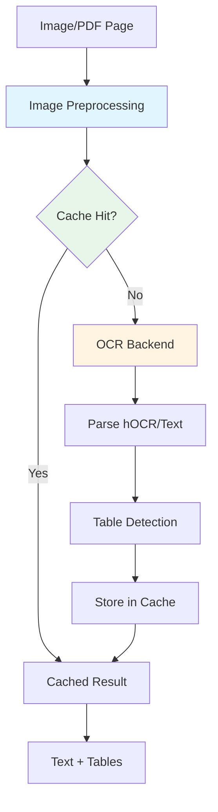

# OCR System

Kreuzberg's OCR (Optical Character Recognition) subsystem extracts text from images and scanned documents. It supports multiple OCR backends and includes intelligent preprocessing, caching, and table detection.

## Architecture



## OCR Backends

Kreuzberg supports multiple OCR engines, each with different trade-offs:

### Tesseract (Default)

**Implementation**: Native Rust bindings via `tesseract-rs`

**Features**:
- Fast and accurate for printed text
- 100+ language support
- hOCR output format for position information
- Table detection support
- No Python dependencies

**Languages**: Install language packs separately:
```bash
# macOS
brew install tesseract-lang

# Ubuntu/Debian
sudo apt-get install tesseract-ocr-all

# Or specific languages
sudo apt-get install tesseract-ocr-eng tesseract-ocr-deu
```

**Configuration**:
=== "Python"

    ```python
    from kreuzberg import extract_file_sync, ExtractionConfig, OcrConfig

    config = ExtractionConfig(
        ocr=OcrConfig(
            backend="tesseract",
            language="eng",  # Single language
            tesseract_config="--psm 3",  # Page segmentation mode
        )
    )

    result = extract_file_sync("scanned.pdf", config=config)
    ```

=== "TypeScript"

    ```typescript
    import { extractFileSync, ExtractionConfig, OcrConfig } from '@goldziher/kreuzberg';

    const config = new ExtractionConfig({
        ocr: new OcrConfig({
            backend: 'tesseract',
            language: 'eng',
            tesseractConfig: '--psm 3',
        })
    });

    const result = extractFileSync('scanned.pdf', null, config);
    ```

**Multiple Languages**:
```python
config = ExtractionConfig(
    ocr=OcrConfig(
        backend="tesseract",
        language="eng+deu+fra",  # English, German, French
    )
)
```

### EasyOCR (Python Only)

**Implementation**: Python package with PyTorch backend

**Features**:
- 80+ language support
- Good for handwritten text
- GPU acceleration support
- Deep learning based

**Installation**:
```bash
pip install "kreuzberg[easyocr]"
```

**Configuration**:
```python
from kreuzberg import extract_file_sync, ExtractionConfig, OcrConfig
from kreuzberg.ocr.easyocr import EasyOCRBackend, register_easyocr

# Register EasyOCR backend
register_easyocr()

config = ExtractionConfig(
    ocr=OcrConfig(
        backend="easyocr",
        language="en",  # EasyOCR uses different language codes
    )
)

result = extract_file_sync("scanned.pdf", config=config)
```

**GPU Support**:
```python
register_easyocr(gpu=True)  # Enable GPU acceleration
```

### PaddleOCR (Python Only)

**Implementation**: Python package with PaddlePaddle backend

**Features**:
- Excellent for Asian languages (Chinese, Japanese, Korean)
- Very fast inference
- Good accuracy for printed text
- Lightweight compared to EasyOCR

**Installation**:
```bash
pip install "kreuzberg[paddleocr]"
```

**Configuration**:
```python
from kreuzberg import extract_file_sync, ExtractionConfig, OcrConfig
from kreuzberg.ocr.paddleocr import PaddleOCRBackend, register_paddleocr

# Register PaddleOCR backend
register_paddleocr()

config = ExtractionConfig(
    ocr=OcrConfig(
        backend="paddleocr",
        language="ch",  # Chinese
    )
)

result = extract_file_sync("scanned.pdf", config=config)
```

## Backend Comparison

| Feature | Tesseract | EasyOCR | PaddleOCR |
|---------|-----------|---------|-----------|
| **Speed** | Fast | Slow | Fast |
| **Accuracy (Latin)** | Excellent | Good | Good |
| **Accuracy (CJK)** | Good | Good | Excellent |
| **Handwriting** | Poor | Good | Fair |
| **GPU Support** | No | Yes | Yes |
| **Languages** | 100+ | 80+ | 80+ |
| **Dependencies** | Native only | Python + PyTorch | Python + PaddlePaddle |
| **Installation Size** | ~10 MB | ~500 MB | ~200 MB |
| **Memory Usage** | Low | High | Medium |

## Image Preprocessing

Kreuzberg automatically preprocesses images for optimal OCR results:

### Preprocessing Steps

1. **DPI Adjustment**: Resizes images to 300 DPI (optimal for OCR)
2. **Contrast Enhancement**: Improves text visibility
3. **Noise Reduction**: Removes artifacts and compression noise
4. **Grayscale Conversion**: Reduces complexity for OCR engine

### Preprocessing Configuration

=== "Python"

    ```python
    from kreuzberg import extract_file_sync, ExtractionConfig, OcrConfig

    config = ExtractionConfig(
        ocr=OcrConfig(
            backend="tesseract",
            language="eng",
            # Preprocessing is enabled by default
        ),
        # Control image quality processing
        enable_quality_processing=True,
    )
    ```

=== "TypeScript"

    ```typescript
    import { extractFileSync, ExtractionConfig, OcrConfig } from '@goldziher/kreuzberg';

    const config = new ExtractionConfig({
        ocr: new OcrConfig({
            backend: 'tesseract',
            language: 'eng',
        }),
        enableQualityProcessing: true,
    });
    ```

### DPI Detection

Kreuzberg detects image DPI from:
- EXIF metadata
- Image file headers
- Estimation based on dimensions (fallback)

Low-DPI images are automatically upscaled to 300 DPI:
```
Original: 150 DPI → Upscaled: 300 DPI (2x)
Original: 72 DPI → Upscaled: 300 DPI (4.17x)
Original: 600 DPI → Downscaled: 300 DPI (0.5x)
```

## OCR Caching

OCR is computationally expensive. Kreuzberg caches OCR results to avoid reprocessing identical images.

### Cache Key Generation

Cache key includes:
- Image content hash (SHA-256)
- OCR backend name
- Language configuration
- Preprocessing settings

### Cache Storage

**Location**: `~/.cache/kreuzberg/ocr/`

**Format**: Binary serialization (fast read/write)

**Expiration**: LRU eviction when cache size exceeds limit (default: 1 GB)

### Cache Configuration

=== "Python"

    ```python
    from kreuzberg import extract_file_sync, ExtractionConfig

    config = ExtractionConfig(
        use_cache=True,  # Enable caching (default: True)
    )

    result = extract_file_sync("scanned.pdf", config=config)
    ```

=== "TypeScript"

    ```typescript
    import { extractFileSync, ExtractionConfig } from '@goldziher/kreuzberg';

    const config = new ExtractionConfig({
        useCache: true,  // Enable caching (default: true)
    });

    const result = extractFileSync('scanned.pdf', null, config);
    ```

### Cache Management

Clear cache programmatically:

=== "Python"

    ```python
    from kreuzberg._utils._cache import clear_cache

    clear_cache()  # Clear all cached OCR results
    ```

=== "TypeScript"

    ```typescript
    // Cache clearing not yet exposed in TypeScript API
    // Clear manually: rm -rf ~/.cache/kreuzberg/ocr/
    ```

## Table Detection

Kreuzberg can detect and extract tables from OCR results using position information.

### How It Works

1. **hOCR Parsing**: Extract word positions from hOCR output (Tesseract only)
2. **Spatial Analysis**: Detect column alignment and row spacing
3. **Cell Reconstruction**: Group words into cells based on position
4. **Table Assembly**: Build table structure from cells

### Table Detection Configuration

=== "Python"

    ```python
    from kreuzberg import extract_file_sync, ExtractionConfig, OcrConfig

    config = ExtractionConfig(
        ocr=OcrConfig(
            backend="tesseract",  # Required for table detection
            language="eng",
        ),
        # Table detection is automatic with Tesseract
    )

    result = extract_file_sync("table.pdf", config=config)

    for table in result.tables:
        print(table.markdown)  # Markdown representation
        print(table.cells)     # Raw cell data
    ```

=== "TypeScript"

    ```typescript
    import { extractFileSync, ExtractionConfig, OcrConfig } from '@goldziher/kreuzberg';

    const config = new ExtractionConfig({
        ocr: new OcrConfig({
            backend: 'tesseract',
            language: 'eng',
        }),
    });

    const result = extractFileSync('table.pdf', null, config);

    for (const table of result.tables) {
        console.log(table.markdown);
        console.log(table.cells);
    }
    ```

### Table Detection Limitations

- **Tesseract only**: EasyOCR and PaddleOCR don't provide position information
- **Requires clear structure**: Works best with well-defined table borders or spacing
- **Complex layouts**: May struggle with merged cells or irregular spacing

## OCR Performance

### Benchmark Results

| Image Type | Resolution | Backend | Time | Accuracy |
|------------|-----------|---------|------|----------|
| Printed text | 300 DPI | Tesseract | 150 ms | 99% |
| Printed text | 300 DPI | EasyOCR | 800 ms | 98% |
| Printed text | 300 DPI | PaddleOCR | 200 ms | 98% |
| Handwritten | 300 DPI | Tesseract | 150 ms | 70% |
| Handwritten | 300 DPI | EasyOCR | 900 ms | 85% |
| Chinese text | 300 DPI | Tesseract | 180 ms | 90% |
| Chinese text | 300 DPI | PaddleOCR | 220 ms | 96% |

### Performance Tips

1. **Use Tesseract for printed text**: Fastest and most accurate for standard documents
2. **Enable GPU for deep learning backends**: 3-5x speedup for EasyOCR/PaddleOCR
3. **Batch processing**: Process multiple images concurrently with `batch_extract_files()`
4. **Cache results**: Enables instant retrieval for repeated processing
5. **Optimize DPI**: 300 DPI is optimal; higher DPI doesn't improve accuracy

## Force OCR

By default, Kreuzberg extracts native text from PDFs. To force OCR on all pages:

=== "Python"

    ```python
    from kreuzberg import extract_file_sync, ExtractionConfig, OcrConfig

    config = ExtractionConfig(
        ocr=OcrConfig(
            backend="tesseract",
            language="eng",
        ),
        force_ocr=True,  # Force OCR even for PDFs with text layer
    )

    result = extract_file_sync("document.pdf", config=config)
    ```

=== "TypeScript"

    ```typescript
    import { extractFileSync, ExtractionConfig, OcrConfig } from '@goldziher/kreuzberg';

    const config = new ExtractionConfig({
        ocr: new OcrConfig({
            backend: 'tesseract',
            language: 'eng',
        }),
        forceOcr: true,
    });

    const result = extractFileSync('document.pdf', null, config);
    ```

**Use Case**: When native PDF text is corrupted or poorly formatted, OCR can provide cleaner results.

## Custom OCR Backends

You can implement custom OCR backends in Python or Rust.

### Python OCR Backend

Implement the `OcrBackend` protocol:

```python
from typing import Protocol
from kreuzberg.types import OcrResult

class OcrBackend(Protocol):
    def process_image(self, image_bytes: bytes, language: str) -> OcrResult:
        """Process image and return OCR result."""
        ...

    def name(self) -> str:
        """Return backend name."""
        ...
```

**Example: Custom OCR Backend**:

```python
from kreuzberg import register_ocr_backend, OcrResult
from kreuzberg.types import OcrWord, BoundingBox
import my_ocr_library

class MyOCRBackend:
    def process_image(self, image_bytes: bytes, language: str) -> OcrResult:
        # Call your OCR library
        result = my_ocr_library.process(image_bytes, lang=language)

        # Convert to OcrResult format
        words = []
        for word_data in result.words:
            words.append(OcrWord(
                text=word_data.text,
                confidence=word_data.confidence,
                bbox=BoundingBox(
                    x=word_data.x,
                    y=word_data.y,
                    width=word_data.width,
                    height=word_data.height,
                ),
            ))

        return OcrResult(
            text=result.text,
            words=words,
            confidence=result.overall_confidence,
        )

    def name(self) -> str:
        return "my_ocr"

# Register the backend
register_ocr_backend("my_ocr", MyOCRBackend())
```

### Rust OCR Backend

Implement the `OcrBackend` trait:

```rust
use kreuzberg::ocr::types::{OcrResult, OcrWord, BoundingBox};
use kreuzberg::plugins::ocr::OcrBackend;
use kreuzberg::error::KreuzbergError;
use async_trait::async_trait;

pub struct MyOcrBackend;

#[async_trait]
impl OcrBackend for MyOcrBackend {
    async fn process_image(
        &self,
        image_bytes: &[u8],
        language: &str,
    ) -> Result<OcrResult, KreuzbergError> {
        // Your OCR implementation
        let text = my_ocr_library::process(image_bytes, language)?;

        Ok(OcrResult {
            text,
            words: vec![],
            confidence: 0.95,
        })
    }

    fn name(&self) -> String {
        "my_ocr".to_string()
    }

    fn supported_languages(&self) -> Vec<String> {
        vec!["eng".to_string(), "deu".to_string()]
    }
}

// Register the backend
use kreuzberg::plugins::registry::get_ocr_backend_registry;
use std::sync::Arc;

let registry = get_ocr_backend_registry();
registry.register("my_ocr", Arc::new(MyOcrBackend))?;
```

## Next Steps

- [Plugin System](plugins.md) - Plugin development guide
- [Extractors](extractors.md) - Format extraction overview
- [Architecture](architecture.md) - Overall system architecture
