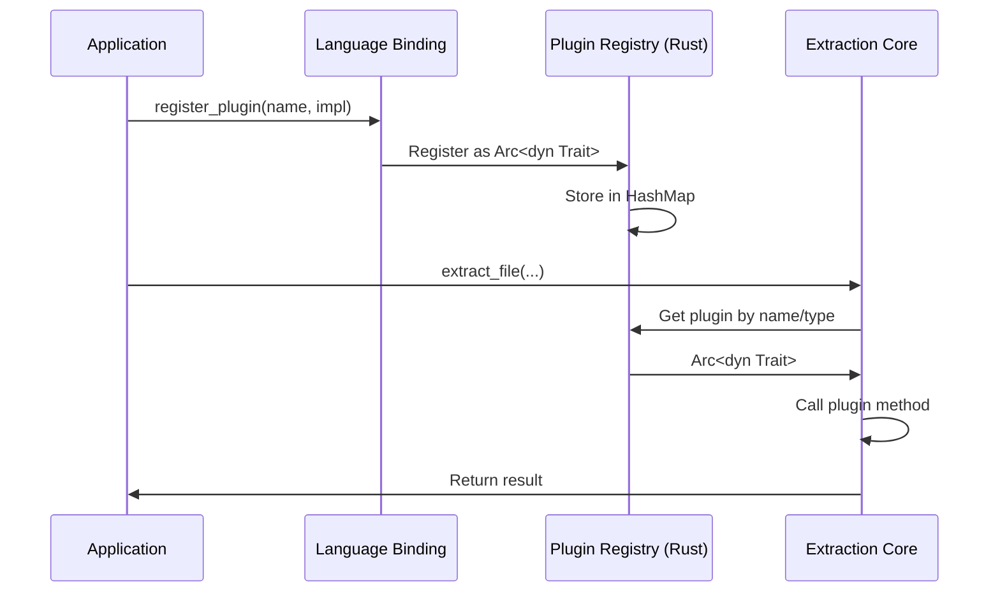

# Plugin System

Kreuzberg's plugin system allows you to extend functionality at multiple points in the extraction pipeline. Plugins can be implemented in Rust, Python, or TypeScript depending on the plugin type.

## Plugin Types

Kreuzberg supports four types of plugins:

### 1. DocumentExtractor

Extract text from specific file formats.

**Capabilities**:
- Register custom file format extractors
- Override built-in extractors with higher priority
- Access to raw file bytes and extraction configuration

**Supported Languages**: Rust only

**Use Cases**:
- Custom binary format parsing
- Specialized document format support
- Format-specific optimization

### 2. OcrBackend

Provide OCR services for image-based text extraction.

**Capabilities**:
- Custom OCR engine integration
- Image preprocessing control
- Position information (for table detection)

**Supported Languages**: Rust, Python

**Use Cases**:
- Integration with cloud OCR services (Google Vision, AWS Textract)
- Specialized OCR engines (handwriting, ancient scripts)
- Custom preprocessing pipelines

### 3. PostProcessor

Transform extraction results after extraction.

**Capabilities**:
- Modify extracted content
- Add or modify metadata
- Filter or enrich results
- Chain multiple processors

**Supported Languages**: Rust, Python, TypeScript

**Use Cases**:
- Content sanitization
- Metadata enrichment
- Format conversion
- PII redaction

### 4. Validator

Validate extraction results and enforce constraints.

**Capabilities**:
- Quality checks
- Content validation
- Constraint enforcement
- Early rejection of invalid results

**Supported Languages**: Rust, Python, TypeScript

**Use Cases**:
- Quality scoring
- Format validation
- Content policy enforcement
- Error detection

## Cross-Language Support Matrix

| Plugin Type | Rust | Python | TypeScript | Notes |
|-------------|------|--------|------------|-------|
| **DocumentExtractor** | ✅ | ❌ | ❌ | Performance-critical, native only |
| **OcrBackend** | ✅ | ✅ | ❌ | Python for ML models, Rust for native |
| **PostProcessor** | ✅ | ✅ | ✅ | Most flexible, all languages supported |
| **Validator** | ✅ | ✅ | ✅ | All languages supported |

## Plugin Architecture

### Registration Flow



### Storage Model

All plugins are stored as `Arc<dyn Trait>` in thread-safe registries:

```rust
// Rust registry internals
pub struct PluginRegistry<T> {
    plugins: RwLock<HashMap<String, Arc<T>>>,
}
```

**Benefits**:
- Thread-safe concurrent access
- Shared ownership across threads
- No copying of plugin implementations
- Dynamic dispatch for flexibility

## PostProcessor Plugins

The most commonly used plugin type. Post-processors run after extraction to transform results.

### Python PostProcessor

**Implementation Requirements**:
- Implement `process()` method taking `ExtractionResult`
- Return modified `ExtractionResult`
- Optionally implement `name()` method

**Example: Metadata Enrichment**:

```python
from kreuzberg import register_post_processor, ExtractionResult

class MetadataEnricher:
    def process(self, result: ExtractionResult) -> ExtractionResult:
        # Add custom metadata
        result.metadata["processed_by"] = "MetadataEnricher"
        result.metadata["content_length"] = len(result.content)
        result.metadata["table_count"] = len(result.tables)
        return result

    def name(self) -> str:
        return "metadata_enricher"

# Register the processor
register_post_processor(MetadataEnricher())
```

**Example: Content Sanitization**:

```python
from kreuzberg import register_post_processor, ExtractionResult
import re

class PIIRedactor:
    def process(self, result: ExtractionResult) -> ExtractionResult:
        # Redact email addresses
        result.content = re.sub(
            r'\b[A-Za-z0-9._%+-]+@[A-Za-z0-9.-]+\.[A-Z|a-z]{2,}\b',
            '[EMAIL REDACTED]',
            result.content
        )

        # Redact phone numbers (US format)
        result.content = re.sub(
            r'\b\d{3}[-.]?\d{3}[-.]?\d{4}\b',
            '[PHONE REDACTED]',
            result.content
        )

        return result

    def name(self) -> str:
        return "pii_redactor"

register_post_processor(PIIRedactor())
```

**Async PostProcessor**:

```python
from kreuzberg import register_post_processor, ExtractionResult
import asyncio

class AsyncEnricher:
    async def process(self, result: ExtractionResult) -> ExtractionResult:
        # Async operations (API calls, database queries, etc.)
        await asyncio.sleep(0.1)  # Simulated async work

        result.metadata["enriched"] = "async"
        return result

    def name(self) -> str:
        return "async_enricher"

register_post_processor(AsyncEnricher())
```

### TypeScript PostProcessor

**Implementation Requirements**:
- Implement `process()` method taking `ExtractionResult`
- Return modified `ExtractionResult` or `Promise<ExtractionResult>`
- Implement `name()` method returning string

**Example: Metadata Enrichment**:

```typescript
import { registerPostProcessor, ExtractionResult } from '@goldziher/kreuzberg';

class MetadataEnricher {
    process(result: ExtractionResult): ExtractionResult {
        // Add custom metadata
        result.metadata.processed_by = 'MetadataEnricher';
        result.metadata.content_length = result.content.length;
        result.metadata.table_count = result.tables.length;
        return result;
    }

    name(): string {
        return 'metadata_enricher';
    }
}

// Register the processor
registerPostProcessor(new MetadataEnricher());
```

**Example: Content Sanitization**:

```typescript
import { registerPostProcessor, ExtractionResult } from '@goldziher/kreuzberg';

class PIIRedactor {
    process(result: ExtractionResult): ExtractionResult {
        // Redact email addresses
        result.content = result.content.replace(
            /\b[A-Za-z0-9._%+-]+@[A-Za-z0-9.-]+\.[A-Z|a-z]{2,}\b/g,
            '[EMAIL REDACTED]'
        );

        // Redact phone numbers (US format)
        result.content = result.content.replace(
            /\b\d{3}[-.]?\d{3}[-.]?\d{4}\b/g,
            '[PHONE REDACTED]'
        );

        return result;
    }

    name(): string {
        return 'pii_redactor';
    }
}

registerPostProcessor(new PIIRedactor());
```

**Async PostProcessor**:

```typescript
import { registerPostProcessor, ExtractionResult } from '@goldziher/kreuzberg';

class AsyncEnricher {
    async process(result: ExtractionResult): Promise<ExtractionResult> {
        // Async operations (API calls, database queries, etc.)
        await new Promise(resolve => setTimeout(resolve, 100));

        result.metadata.enriched = 'async';
        return result;
    }

    name(): string {
        return 'async_enricher';
    }
}

registerPostProcessor(new AsyncEnricher());
```

### Rust PostProcessor

**Implementation Requirements**:
- Implement `PostProcessor` trait
- Handle both sync and async processing

**Example: Metadata Enrichment**:

```rust
use kreuzberg::plugins::processor::PostProcessor;
use kreuzberg::types::ExtractionResult;
use kreuzberg::error::KreuzbergError;
use async_trait::async_trait;

pub struct MetadataEnricher;

#[async_trait]
impl PostProcessor for MetadataEnricher {
    async fn process(
        &self,
        mut result: ExtractionResult,
    ) -> Result<ExtractionResult, KreuzbergError> {
        // Add custom metadata
        result.metadata.insert(
            "processed_by".to_string(),
            serde_json::json!("MetadataEnricher"),
        );
        result.metadata.insert(
            "content_length".to_string(),
            serde_json::json!(result.content.len()),
        );
        result.metadata.insert(
            "table_count".to_string(),
            serde_json::json!(result.tables.len()),
        );

        Ok(result)
    }

    fn name(&self) -> String {
        "metadata_enricher".to_string()
    }
}

// Register the processor
use kreuzberg::plugins::registry::get_post_processor_registry;
use std::sync::Arc;

let registry = get_post_processor_registry();
registry.register("metadata_enricher", Arc::new(MetadataEnricher))?;
```

## OcrBackend Plugins

OCR backends are specialized plugins for text extraction from images.

### Python OCR Backend

**Implementation Requirements**:
- Implement `process_image()` method
- Return `OcrResult` with text and optional word positions
- Implement `name()` method

**Example: Cloud OCR Service**:

```python
from kreuzberg import register_ocr_backend
from kreuzberg.types import OcrResult, OcrWord, BoundingBox
import requests

class GoogleVisionOCR:
    def __init__(self, api_key: str):
        self.api_key = api_key

    def process_image(self, image_bytes: bytes, language: str) -> OcrResult:
        # Call Google Vision API
        response = requests.post(
            f'https://vision.googleapis.com/v1/images:annotate?key={self.api_key}',
            json={
                'requests': [{
                    'image': {'content': image_bytes.hex()},
                    'features': [{'type': 'TEXT_DETECTION'}],
                    'imageContext': {'languageHints': [language]},
                }]
            }
        )

        data = response.json()['responses'][0]
        text = data['fullTextAnnotation']['text']

        # Convert to OcrResult
        words = []
        for page in data['fullTextAnnotation']['pages']:
            for block in page['blocks']:
                for paragraph in block['paragraphs']:
                    for word_data in paragraph['words']:
                        word_text = ''.join([s['text'] for s in word_data['symbols']])
                        bbox = word_data['boundingBox']

                        words.append(OcrWord(
                            text=word_text,
                            confidence=word_data['confidence'],
                            bbox=BoundingBox(
                                x=bbox['vertices'][0]['x'],
                                y=bbox['vertices'][0]['y'],
                                width=bbox['vertices'][2]['x'] - bbox['vertices'][0]['x'],
                                height=bbox['vertices'][2]['y'] - bbox['vertices'][0]['y'],
                            ),
                        ))

        return OcrResult(
            text=text,
            words=words,
            confidence=data['fullTextAnnotation']['pages'][0]['confidence'],
        )

    def name(self) -> str:
        return "google_vision"

# Register the backend
register_ocr_backend("google_vision", GoogleVisionOCR(api_key="your_key_here"))
```

**Usage**:

```python
from kreuzberg import extract_file_sync, ExtractionConfig, OcrConfig

config = ExtractionConfig(
    ocr=OcrConfig(
        backend="google_vision",  # Use custom backend
        language="en",
    )
)

result = extract_file_sync("scanned.pdf", config=config)
```

## Validator Plugins

Validators run after post-processing to check result quality and enforce constraints.

### Python Validator

**Implementation Requirements**:
- Implement `validate()` method taking `ExtractionResult`
- Raise `ValidationError` if validation fails
- Return `None` on success

**Example: Content Length Validator**:

```python
from kreuzberg import register_validator, ExtractionResult, ValidationError

class MinimumContentValidator:
    def __init__(self, min_length: int = 100):
        self.min_length = min_length

    def validate(self, result: ExtractionResult) -> None:
        if len(result.content) < self.min_length:
            raise ValidationError(
                f"Content too short: {len(result.content)} < {self.min_length}"
            )

    def name(self) -> str:
        return "minimum_content"

register_validator(MinimumContentValidator(min_length=100))
```

### TypeScript Validator

**Implementation Requirements**:
- Implement `validate()` method taking `ExtractionResult`
- Throw `ValidationError` if validation fails
- Return void or Promise<void>

**Example: Content Length Validator**:

```typescript
import { registerValidator, ExtractionResult, ValidationError } from '@goldziher/kreuzberg';

class MinimumContentValidator {
    private minLength: number;

    constructor(minLength: number = 100) {
        this.minLength = minLength;
    }

    validate(result: ExtractionResult): void {
        if (result.content.length < this.minLength) {
            throw new ValidationError(
                `Content too short: ${result.content.length} < ${this.minLength}`
            );
        }
    }

    name(): string {
        return 'minimum_content';
    }
}

registerValidator(new MinimumContentValidator(100));
```

## Plugin Management

### Registration

All plugin types use a similar registration API:

=== "Python"

    ```python
    from kreuzberg import (
        register_post_processor,
        register_ocr_backend,
        register_validator,
        unregister_post_processor,
        clear_post_processors,
    )

    # Register
    register_post_processor(MyProcessor())
    register_ocr_backend("my_ocr", MyOCRBackend())
    register_validator(MyValidator())

    # Unregister
    unregister_post_processor("my_processor")

    # Clear all processors
    clear_post_processors()
    ```

=== "TypeScript"

    ```typescript
    import {
        registerPostProcessor,
        registerValidator,
        unregisterPostProcessor,
        clearPostProcessors,
    } from '@goldziher/kreuzberg';

    // Register
    registerPostProcessor(new MyProcessor());
    registerValidator(new MyValidator());

    // Unregister
    unregisterPostProcessor('my_processor');

    // Clear all processors
    clearPostProcessors();
    ```

=== "Rust"

    ```rust
    use kreuzberg::plugins::registry::{
        get_post_processor_registry,
        get_ocr_backend_registry,
        get_validator_registry,
    };
    use std::sync::Arc;

    // Register
    let processor_registry = get_post_processor_registry();
    processor_registry.register("my_processor", Arc::new(MyProcessor))?;

    let ocr_registry = get_ocr_backend_registry();
    ocr_registry.register("my_ocr", Arc::new(MyOCRBackend))?;

    let validator_registry = get_validator_registry();
    validator_registry.register("my_validator", Arc::new(MyValidator))?;

    // Unregister
    processor_registry.unregister("my_processor")?;

    // Clear all
    processor_registry.clear();
    ```

### Execution Order

Plugins execute in the following order during extraction:

1. **DocumentExtractor**: Selected based on MIME type and priority
2. **PostProcessors**: Run in registration order
3. **Validators**: Run after all post-processors


### Error Handling

Plugin errors are propagated as `KreuzbergError`:

=== "Python"

    ```python
    from kreuzberg import extract_file_sync, KreuzbergError

    try:
        result = extract_file_sync("document.pdf")
    except KreuzbergError as e:
        print(f"Plugin error: {e}")
    ```

=== "TypeScript"

    ```typescript
    import { extractFileSync, KreuzbergError } from '@goldziher/kreuzberg';

    try {
        const result = extractFileSync('document.pdf');
    } catch (error) {
        if (error instanceof KreuzbergError) {
            console.error(`Plugin error: ${error.message}`);
        }
    }
    ```

## Thread Safety

All plugin implementations must be thread-safe:

- **Rust**: Implement `Send + Sync` traits
- **Python**: Ensure no shared mutable state (or use proper locking)
- **TypeScript**: Avoid shared mutable state

Kreuzberg may call plugin methods concurrently from multiple threads.

## Best Practices

### Performance

1. **Minimize allocations**: Reuse buffers and avoid unnecessary copies
2. **Use async for I/O**: Implement async variants for network/disk operations
3. **Cache expensive operations**: Store results when possible
4. **Batch operations**: Process multiple results together when possible

### Error Handling

1. **Be specific**: Include context in error messages
2. **Don't swallow errors**: Let system errors bubble up
3. **Validate inputs**: Check parameters before processing
4. **Document failures**: Log errors for debugging

### Testing

1. **Test edge cases**: Empty input, large input, malformed data
2. **Test concurrency**: Verify thread safety
3. **Test error paths**: Ensure errors are handled correctly
4. **Benchmark**: Measure performance impact

## Next Steps

- [Architecture](architecture.md) - Overall system architecture
- [Extractors](extractors.md) - Format extraction overview
- [OCR System](ocr.md) - OCR subsystem architecture
