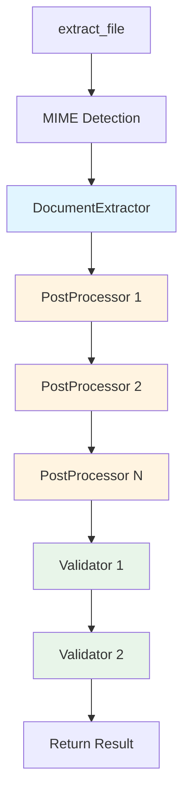

# Plugin Development Overview

Kreuzberg's plugin system allows you to extend functionality at multiple points in the extraction pipeline. This guide covers what plugins you can create in each language and how to get started.

## Plugin Capabilities by Language

Different languages support different plugin types based on their integration level:

| Plugin Type | Python | TypeScript | Rust | Notes |
|-------------|--------|------------|------|-------|
| **PostProcessor** | ✅ | ✅ | ✅ | Transform extraction results |
| **Validator** | ✅ | ✅ | ✅ | Validate extraction quality |
| **OcrBackend** | ✅ | ❌ | ✅ | Custom OCR engines |
| **DocumentExtractor** | ❌ | ❌ | ✅ | Custom file format extractors |

### Why These Limitations?

- **DocumentExtractor (Rust only)**: Requires direct access to Rust core for performance and memory management
- **OcrBackend (Python/Rust)**: Python supports this for ML model integration (PyTorch, TensorFlow)
- **PostProcessor/Validator (All languages)**: Highest-level plugins, easy to implement in any language

## Getting Started

### Python Plugin Development

**Requirements**:
- Python 3.10+
- `kreuzberg` package installed

**Supported Plugins**:
1. PostProcessors - Transform extraction results
2. Validators - Validate extraction quality
3. OCR Backends - Custom OCR engines

**Getting Started**:
```python
from kreuzberg import register_post_processor, ExtractionResult

class MyPlugin:
    def process(self, result: ExtractionResult) -> ExtractionResult:
        # Your logic here
        return result

    def name(self) -> str:
        return "my_plugin"

register_post_processor(MyPlugin())
```

**Learn More**:
- [Python OCR Backend Guide](python-ocr-backend.md)
- [Python PostProcessor Guide](python-postprocessor.md)

### TypeScript Plugin Development

**Requirements**:
- Node.js 18+
- `@goldziher/kreuzberg` package installed

**Supported Plugins**:
1. PostProcessors - Transform extraction results
2. Validators - Validate extraction quality

**Getting Started**:
```typescript
import { registerPostProcessor, ExtractionResult } from '@goldziher/kreuzberg';

class MyPlugin {
    process(result: ExtractionResult): ExtractionResult {
        // Your logic here
        return result;
    }

    name(): string {
        return 'my_plugin';
    }
}

registerPostProcessor(new MyPlugin());
```

**Learn More**:
- [TypeScript PostProcessor Guide](typescript-postprocessor.md)

### Rust Plugin Development

**Requirements**:
- Rust 1.75+
- `kreuzberg` crate as dependency

**Supported Plugins**:
1. DocumentExtractors - Custom file format extractors
2. OCR Backends - Custom OCR engines
3. PostProcessors - Transform extraction results
4. Validators - Validate extraction quality

**Getting Started**:
```rust
use kreuzberg::plugins::processor::PostProcessor;
use kreuzberg::types::ExtractionResult;
use async_trait::async_trait;

pub struct MyPlugin;

#[async_trait]
impl PostProcessor for MyPlugin {
    async fn process(&self, result: ExtractionResult)
        -> Result<ExtractionResult, KreuzbergError> {
        // Your logic here
        Ok(result)
    }

    fn name(&self) -> String {
        "my_plugin".to_string()
    }
}
```

**Learn More**:
- [Rust Custom Extractor Guide](rust-custom-extractor.md)

## Plugin Execution Flow

Understanding when plugins execute helps you choose the right plugin type:



### Execution Order

1. **DocumentExtractor**: Runs once per file, selected by MIME type and priority
2. **PostProcessors**: Run in registration order, chain results
3. **Validators**: Run after all post-processors, can reject results

### When to Use Each Plugin Type

#### DocumentExtractor (Rust only)
**Use when**:
- Adding support for a new file format
- Optimizing extraction for a specific format
- Replacing built-in extractor with custom logic

**Examples**:
- Custom CSV parser with advanced dialect detection
- Proprietary binary format support
- Optimized PDF extraction for specific document types

#### OcrBackend (Python/Rust)
**Use when**:
- Integrating cloud OCR services (Google Vision, AWS Textract)
- Using custom ML models for OCR
- Specialized OCR for specific domains (handwriting, ancient scripts)

**Examples**:
- Google Cloud Vision API integration
- Custom PyTorch model for handwriting recognition
- Azure Cognitive Services OCR

#### PostProcessor (All languages)
**Use when**:
- Transforming extraction results
- Adding metadata or enrichment
- Cleaning or filtering content
- Format conversion

**Examples**:
- PII redaction
- Language translation
- Metadata enrichment from external APIs
- Content summarization
- Text normalization

#### Validator (All languages)
**Use when**:
- Enforcing quality requirements
- Checking content constraints
- Validating metadata
- Rejecting low-quality results

**Examples**:
- Minimum content length check
- Required metadata validation
- Quality score threshold enforcement
- Content policy compliance

## Plugin Best Practices

### Performance

1. **Minimize allocations**: Reuse buffers and avoid unnecessary copying
2. **Use async for I/O**: Don't block the executor for network/disk operations
3. **Cache expensive operations**: Store computed results when possible
4. **Batch when possible**: Process multiple results together

### Error Handling

1. **Be specific**: Include context in error messages
2. **Don't suppress system errors**: Let OSError and RuntimeError bubble up
3. **Validate inputs early**: Check parameters before processing
4. **Document failure modes**: Explain what can go wrong

### Thread Safety

All plugins must be thread-safe:
- **Python**: No shared mutable state (or use proper locking)
- **TypeScript**: Avoid shared mutable state
- **Rust**: Implement `Send + Sync` traits

Kreuzberg may call plugin methods concurrently from multiple threads.

### Testing

1. **Test edge cases**: Empty input, large input, malformed data
2. **Test concurrency**: Verify thread safety with parallel calls
3. **Test error paths**: Ensure errors are handled correctly
4. **Benchmark**: Measure performance impact on extraction

## Common Patterns

### Metadata Enrichment Pattern

Add custom metadata to extraction results:

=== "Python"

    ```python
    from kreuzberg import register_post_processor, ExtractionResult

    class MetadataEnricher:
        def process(self, result: ExtractionResult) -> ExtractionResult:
            result.metadata["processed_at"] = datetime.now().isoformat()
            result.metadata["word_count"] = len(result.content.split())
            return result

        def name(self) -> str:
            return "metadata_enricher"

    register_post_processor(MetadataEnricher())
    ```

=== "TypeScript"

    ```typescript
    import { registerPostProcessor, ExtractionResult } from '@goldziher/kreuzberg';

    class MetadataEnricher {
        process(result: ExtractionResult): ExtractionResult {
            result.metadata.processed_at = new Date().toISOString();
            result.metadata.word_count = result.content.split(/\s+/).length;
            return result;
        }

        name(): string {
            return 'metadata_enricher';
        }
    }

    registerPostProcessor(new MetadataEnricher());
    ```

### Content Filtering Pattern

Filter or redact sensitive content:

=== "Python"

    ```python
    from kreuzberg import register_post_processor, ExtractionResult
    import re

    class PIIRedactor:
        def process(self, result: ExtractionResult) -> ExtractionResult:
            # Redact emails
            result.content = re.sub(
                r'\b[A-Za-z0-9._%+-]+@[A-Za-z0-9.-]+\.[A-Z|a-z]{2,}\b',
                '[EMAIL]',
                result.content
            )
            return result

        def name(self) -> str:
            return "pii_redactor"

    register_post_processor(PIIRedactor())
    ```

=== "TypeScript"

    ```typescript
    import { registerPostProcessor, ExtractionResult } from '@goldziher/kreuzberg';

    class PIIRedactor {
        process(result: ExtractionResult): ExtractionResult {
            result.content = result.content.replace(
                /\b[A-Za-z0-9._%+-]+@[A-Za-z0-9.-]+\.[A-Z|a-z]{2,}\b/g,
                '[EMAIL]'
            );
            return result;
        }

        name(): string {
            return 'pii_redactor';
        }
    }

    registerPostProcessor(new PIIRedactor());
    ```

### External API Pattern

Enrich results with external API calls:

=== "Python"

    ```python
    from kreuzberg import register_post_processor, ExtractionResult
    import requests

    class ExternalEnricher:
        def __init__(self, api_key: str):
            self.api_key = api_key

        async def process(self, result: ExtractionResult) -> ExtractionResult:
            # Async API call for enrichment
            response = await self._call_api(result.content[:1000])
            result.metadata["external_data"] = response
            return result

        async def _call_api(self, text: str) -> dict:
            # Implementation
            pass

        def name(self) -> str:
            return "external_enricher"

    register_post_processor(ExternalEnricher(api_key="..."))
    ```

=== "TypeScript"

    ```typescript
    import { registerPostProcessor, ExtractionResult } from '@goldziher/kreuzberg';

    class ExternalEnricher {
        constructor(private apiKey: string) {}

        async process(result: ExtractionResult): Promise<ExtractionResult> {
            const response = await this.callApi(result.content.substring(0, 1000));
            result.metadata.external_data = response;
            return result;
        }

        private async callApi(text: string): Promise<any> {
            // Implementation
        }

        name(): string {
            return 'external_enricher';
        }
    }

    registerPostProcessor(new ExternalEnricher('...'));
    ```

### Validation Pattern

Enforce quality requirements:

=== "Python"

    ```python
    from kreuzberg import register_validator, ExtractionResult, ValidationError

    class QualityValidator:
        def __init__(self, min_length: int = 100):
            self.min_length = min_length

        def validate(self, result: ExtractionResult) -> None:
            if len(result.content) < self.min_length:
                raise ValidationError(
                    f"Content too short: {len(result.content)} < {self.min_length}"
                )

        def name(self) -> str:
            return "quality_validator"

    register_validator(QualityValidator(min_length=100))
    ```

=== "TypeScript"

    ```typescript
    import { registerValidator, ExtractionResult, ValidationError } from '@goldziher/kreuzberg';

    class QualityValidator {
        constructor(private minLength: number = 100) {}

        validate(result: ExtractionResult): void {
            if (result.content.length < this.minLength) {
                throw new ValidationError(
                    `Content too short: ${result.content.length} < ${this.minLength}`
                );
            }
        }

        name(): string {
            return 'quality_validator';
        }
    }

    registerValidator(new QualityValidator(100));
    ```

## Next Steps

Choose your language and plugin type:

### Python Guides
- [Python OCR Backend Development](python-ocr-backend.md)
- [Python PostProcessor Development](python-postprocessor.md)

### TypeScript Guides
- [TypeScript PostProcessor Development](typescript-postprocessor.md)

### Rust Guides
- [Rust Custom Extractor Development](rust-custom-extractor.md)

### General Resources
- [Plugin System Concepts](../concepts/plugins.md) - Architecture overview
- [API Reference](../api-reference/python/) - Complete API documentation
